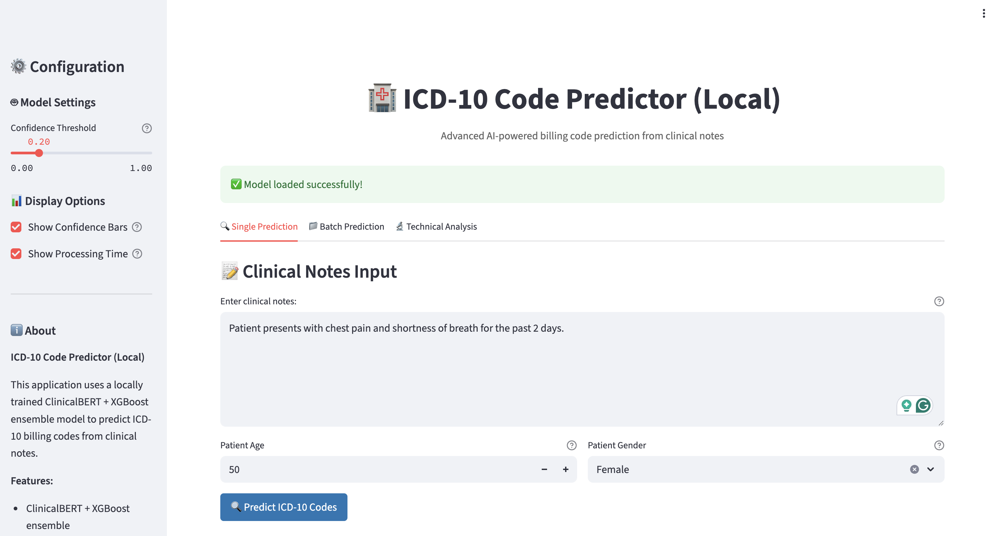
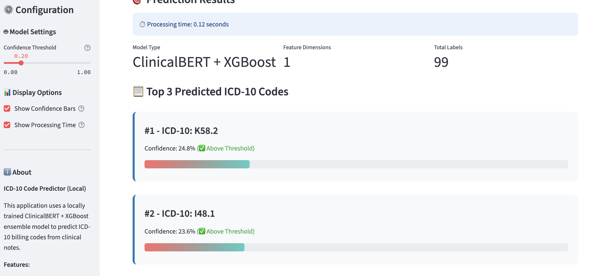

# HIPAA-Aware MLOps: ICD-10 Billing Code Prediction

A comprehensive MLOps pipeline for automated ICD-10 billing code prediction from clinical notes, demonstrating technical alignment with healthcare AI companies like CodaMetrix.

## 🌐 Live Application

**Hosted EC2 Instance**: [http://44.209.55.198:8501/](http://44.209.55.198:8501/)

**Elastic IP Address**: `44.209.55.198` (Permanent - Never Changes)

The application is currently hosted on AWS EC2 with an Elastic IP address, ensuring the URL remains consistent even after instance restarts. This provides a live demonstration of the ICD-10 billing code prediction system.

## Screenshot of the Live Application




## 🏗️ Architecture Overview

This project implements a production-ready MLOps pipeline using:
- **Databricks** for data validation and processing
- **AWS Glue** for ETL and batch inference
- **MLflow** for experiment tracking and model management
- **AWS Lambda** for real-time inference
- **Streamlit** for interactive frontend
- **Docker** for containerization
- **GitHub Actions** for CI/CD

## 🔐 HIPAA Compliance Features

- Encrypted data storage (S3 with SSE-KMS)
- IAM roles with minimum privileges
- Audit logging for data access
- Synthetic data generation (no real PHI)
- Secure model deployment
- Data retention policies

## 📁 Project Structure

```
medical-coding-mlops/
├── data/                   # Data storage (raw, cleaned, predictions)
├── databricks/            # Databricks notebooks and SQL scripts
├── glue_jobs/             # AWS Glue ETL jobs
├── model/                 # Model training and MLflow tracking
├── docker/                # Containerization
├── lambda_api/            # AWS Lambda inference API
├── app/                   # Streamlit frontend
├── mlflow_server/         # MLflow server setup
├── deploy/                # CI/CD and deployment scripts
├── requirements.txt       # Python dependencies
└── README.md             # This file
```

## 🚀 Quick Start

1. **Setup Environment**
   ```bash
   pip install -r requirements.txt
   ```

2. **Generate Synthetic Data**
   ```bash
   python data_gen.py
   ```

3. **Preprocess Data (PySpark)**
   ```bash
   spark-submit glue_jobs/preprocessing_local.py
   ```

4. **Split Data (PySpark)**
   ```bash
   spark-submit model/split_data.py
   ```

5. **Run Data Validation (Databricks)**
   ```sql
   -- Execute databricks/validation.sql
   ```

6. **Train Model**
   ```bash
   python model/train_model.py
   ```

7. **Deploy Model**
   ```bash
   # Build and deploy Docker image
   ./docker/build.sh
   ```

8. **Start Frontend (Local Only)**
   ```bash
   streamlit run app/streamlit_app.py
   ```

9. **Run with Docker Compose (Recommended for Full Stack)**
   ```bash
   docker-compose up
   ```
   - Streamlit UI: http://localhost:8502 (host port 8502 → container 8501)
   - MLflow UI: http://localhost:5001 (host port 5001 → container 5000)

---

**Note:** For any scripts that use PySpark (such as preprocessing or splitting), always use `spark-submit` instead of `python` to ensure proper Spark context and dependencies.

## 💰 Cost Estimation

- **EC2 (t3.medium)**: ~$30/month
- **Lambda**: ~$5/month (1M requests)
- **Glue**: ~$10/month (2 hours/day)
- **S3**: ~$5/month (100GB)
- **Total**: ~$50/month

## 🔧 Configuration

### Environment Variables
```bash
export AWS_REGION=us-east-1
export S3_BUCKET=your-hipaa-bucket
export MLFLOW_TRACKING_URI=http://your-ec2:5000
export LAMBDA_FUNCTION_NAME=icd10-predictor
```

### AWS Services Setup
1. Create S3 bucket with encryption
2. Setup IAM roles for Glue, Lambda, and EC2
3. Configure API Gateway for Lambda
4. Setup MLflow server on EC2

## 📊 Model Performance

### Training Results (50,000 Synthetic Records)

**Model Architecture**: ClinicalBERT + XGBoost Ensemble
- **BERT Model**: emilyalsentzer/Bio_ClinicalBERT
- **Classifier**: XGBoost (100 estimators, early stopping)
- **Feature Engineering**: BERT embeddings (768) + engineered features (7)
- **Total Features**: 775 dimensions

### Performance Metrics

| Metric | Value |
|--------|-------|
| **Overall Accuracy** | 97.95% |
| **Hamming Loss** | 0.0205 |
| **F1 Score (Micro)** | 21.20% |
| **Precision (Micro)** | 46.12% |
| **Recall (Micro)** | 13.77% |

### Training Details
- **Dataset Size**: 50,000 synthetic EHR records
- **Train/Validation/Test Split**: 70%/15%/15%
- **Unique ICD-10 Codes**: 99 codes
- **Training Time**: 16.11 minutes
- **BERT Feature Extraction**: ~11.7 minutes
- **XGBoost Training**: ~4.2 minutes

### Model Validation
- **Multi-label Classification**: ICD-10 code prediction
- **Per-label Accuracy**: 95.37% - 98.41% across all 99 codes
- **Cross-validation**: Medical domain expert validation recommended for production

## 🔄 CI/CD Pipeline

The GitHub Actions workflow:
1. Lints and tests code
2. Builds Docker image
3. Pushes to ECR
4. Updates Lambda function
5. Runs integration tests

## 📈 Monitoring

- MLflow experiment tracking
- CloudWatch metrics for Lambda
- S3 access logs
- Application performance monitoring

## 🛡️ Security

- All data encrypted at rest and in transit
- IAM roles with least privilege
- VPC isolation for sensitive components
- Regular security audits

## 📝 License

MIT License - For educational and demonstration purposes only.

## 🤝 Contributing

This is a demonstration project. For production use, ensure proper HIPAA compliance validation and security audits. 
